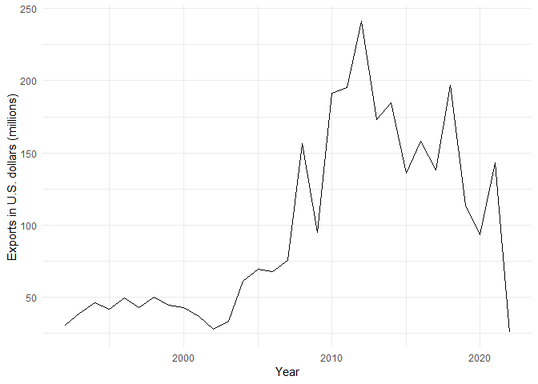

U.S.-Liberia trade
================

Source: [U.S. Census
Bureau](https://www.census.gov/foreign-trade/balance/c7650.html)

## U.S. trade balance with Liberia by year

<!-- -->

| YEAR | IMPORTS | EXPORTS | BALANCE |
|:-----|--------:|--------:|--------:|
| 1992 |    12.3 |    30.6 |    18.3 |
| 1993 |     3.0 |    39.1 |    36.1 |
| 1994 |     3.4 |    46.4 |    43.0 |
| 1995 |     9.9 |    41.7 |    31.8 |
| 1996 |    26.9 |    49.8 |    22.9 |
| 1997 |     4.7 |    42.8 |    38.1 |
| 1998 |    25.1 |    50.3 |    25.2 |
| 1999 |    30.5 |    44.8 |    14.3 |
| 2000 |    45.5 |    43.0 |    -2.5 |
| 2001 |    42.5 |    36.6 |    -5.9 |
| 2002 |    45.7 |    27.8 |   -17.9 |
| 2003 |    59.5 |    33.3 |   -26.2 |
| 2004 |    84.3 |    60.9 |   -23.4 |
| 2005 |    90.8 |    69.3 |   -21.5 |
| 2006 |   139.9 |    67.8 |   -72.1 |
| 2007 |   115.2 |    75.8 |   -39.4 |
| 2008 |   143.5 |   156.7 |    13.2 |
| 2009 |    80.4 |    94.7 |    14.4 |
| 2010 |   180.0 |   191.4 |    11.3 |
| 2011 |   158.2 |   195.2 |    37.0 |
| 2012 |   144.0 |   241.1 |    97.1 |
| 2013 |    96.5 |   173.2 |    76.7 |
| 2014 |    83.4 |   184.5 |   101.1 |
| 2015 |    44.9 |   135.8 |    90.9 |
| 2016 |    64.1 |   158.0 |    93.9 |
| 2017 |    91.2 |   138.3 |    47.2 |
| 2018 |    61.6 |   196.7 |   135.1 |
| 2019 |    65.6 |   113.9 |    48.2 |
| 2020 |    45.1 |    93.2 |    48.1 |
| 2021 |    21.7 |    28.6 |     6.9 |

## Imports from Liberia (in millions)

<!-- -->

## Exports to Liberia (in millions)

<!-- -->

## Top 20 U.S. products exported to Liberia, 2011-2020 (U.S. dollars)

| EXPORT                                                  |        TOTAL |
|:--------------------------------------------------------|-------------:|
| Drilling & oilfield equipment                           | $244,157,652 |
| Apparel, household goods - textile                      | $114,466,390 |
| Passenger cars, new and used                            | $110,089,405 |
| Wheat                                                   |  $91,935,691 |
| Rice                                                    |  $91,010,618 |
| Industrial machines, other                              |  $80,355,872 |
| Materials handling equipment                            |  $72,068,800 |
| Minimum value shipments                                 |  $65,935,651 |
| Finished metal shapes                                   |  $62,853,404 |
| Other foods                                             |  $61,676,686 |
| Measuring, testing, control instruments                 |  $50,675,903 |
| Petroleum products, other                               |  $48,216,172 |
| Excavating machinery                                    |  $42,573,593 |
| Railway transportation equipment                        |  $33,432,660 |
| Other parts and accessories of vehicles                 |  $25,599,661 |
| Cell phones and other household goods, n.e.c.           |  $21,714,301 |
| Meat, poultry, etc.                                     |  $19,029,801 |
| Plastic materials                                       |  $18,724,345 |
| Miscellaneous domestic exports and special transactions |  $18,318,675 |
| Electric apparatus                                      |  $17,976,887 |

## Top 20 U.S. products imported from Liberia, 2011-2020 (U.S. dollars)

| IMPORT                                        |        TOTAL |
|:----------------------------------------------|-------------:|
| Natural rubber                                | $767,293,303 |
| U.S. goods returned, and reimports            |  $48,669,582 |
| Sulfur, nonmetallic minerals                  |  $11,864,409 |
| Gem diamonds                                  |  $10,497,980 |
| Food oils, oilseeds                           |   $4,917,110 |
| Artwork, antiques, stamps, etc.               |   $4,454,875 |
| Nonmonetary gold                              |   $1,839,060 |
| Lumber                                        |     $829,873 |
| Cell phones and other household goods, n.e.c. |     $729,439 |
| Semiconductors                                |     $705,627 |
| Minimum value shipments                       |     $523,140 |
| Gem stones, other                             |     $498,379 |
| Pharmaceutical preparations                   |     $210,985 |
| Petroleum products, other                     |     $200,279 |
| Chemicals-other, n.e.c.                       |     $171,395 |
| Other parts and accessories of vehicles       |     $164,138 |
| Cocoa beans                                   |     $161,011 |
| Photo, service industry machinery             |     $159,024 |
| Synthetic rubber–primary                      |     $148,952 |
| Numismatic coins                              |     $132,947 |

## Liberian rubber exports to U.S.

<!-- -->

| YEAR |        TOTAL |
|:-----|-------------:|
| 2011 | $156,754,793 |
| 2012 | $142,848,717 |
| 2013 |  $91,242,140 |
| 2014 |  $73,396,277 |
| 2015 |  $41,155,589 |
| 2016 |  $41,143,163 |
| 2017 |  $59,409,074 |
| 2018 |  $56,124,030 |
| 2019 |  $61,563,489 |
| 2020 |  $43,656,031 |
